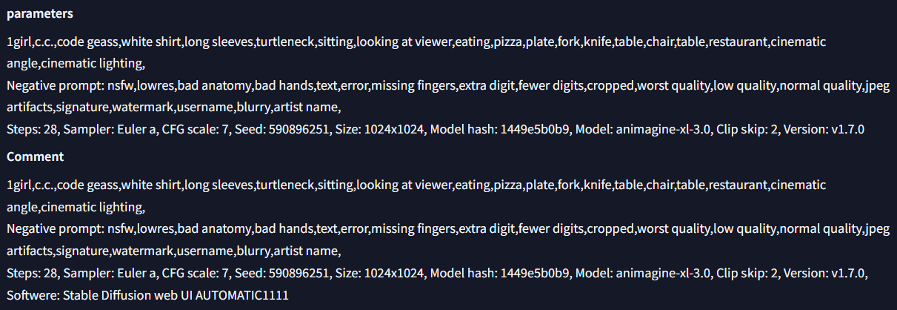

# sd-webui-xnview-pnginfo
[日本語](#日本語) | [English](#english)

# 日本語

# 説明
- AUTOMATIC1111で生成されたPNG画像に対して、XnViewのクイック検索でメタデータの検索が可能になります。  
- 既存のparametersと同じ内容をCommentに記載することで、XnViewのクイック検索でメタデータの検索が可能となっています。
- AUTOMATIC1111生成画像であることを識別するために、Comment末尾に「Softwere: Stable Diffusion web UI AUTOMATIC1111」を追加しています。同一ディレクトリにNovel AI生成画像が混在している場合等でも識別が可能です。
<br><br>

<br><br>

# 対象ファイル形式
- PNG
- JPEG, WEBP, GIFはメタデータのフォーマットが異なるため対応していません。 
<br><br>

# 使い方
本拡張機能をインストールし、通常通り画像を生成します。
<br><br>

# インストール方法
AUTOMATIC1111のExtensionsタブをクリック、Install from URLタブをクリックし、URL for extension's git repositoryに以下のurlを入力しInstallボタンをクリックしてください。
```
https://github.com/Takenoko3333/sd-webui-xnview-pnginfo.git
```
<br>

# 変更履歴

## [1.0.0] - 2024-2-12
### 追加
- v1.0.0リリース 
<br><br>

# ライセンス
Copyright © 2024 Takenoko  
Released under the [MIT](https://opensource.org/licenses/mit-license.php) license.
<br><br><br>

# English

# Description
- Metadata search via XnView's quick search is now enabled for PNG images created by AUTOMATIC1111.
- By including the same content in the Comment as in the existing parameters, metadata search through XnView's quick search is facilitated.
- To identify images as created by AUTOMATIC1111, "Software: Stable Diffusion web UI AUTOMATIC1111" is added to the end of the Comment. This allows for identification even in directories mixed with images generated by Novel AI.
<br><br>

<br><br>

# Target file formats
- PNG
- JPEG, WEBP, GIF are not supported as their metadata format is different.

# How to use
Install this extension and generate images as usual.

# Installation method
Click the Extensions tab in AUTOMATIC1111, click the Install from URL tab, enter the following URL in the URL for extension's git repository field, and click the Install button.
```
https://github.com/Takenoko3333/sd-webui-xnview-pnginfo.git
```
<br>

# Changelog

## [1.0.0] - 2024-2-12
### Added
- v1.0.0 release

# License
Copyright © 2024 Takenoko  
Released under the [MIT License](https://opensource.org/licenses/mit-license.php).
